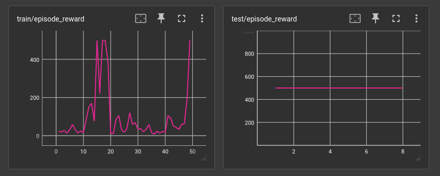
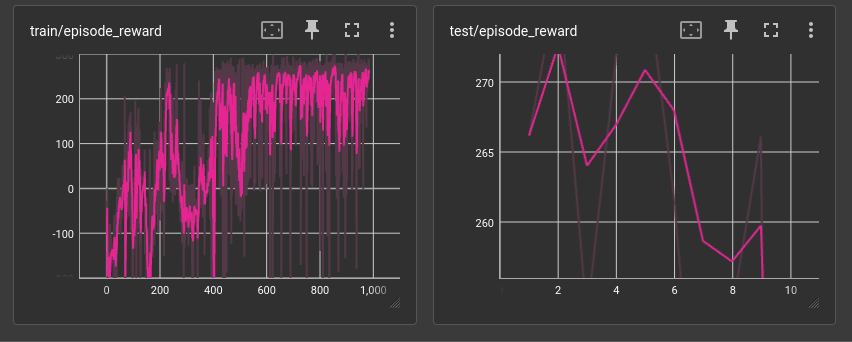
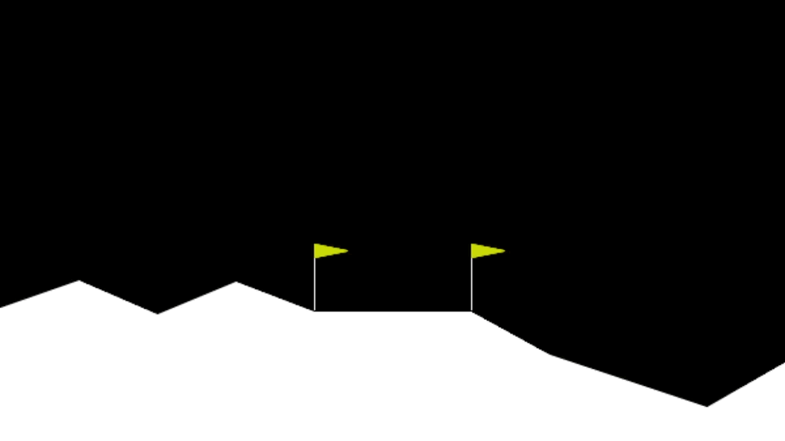

# Kioku

    
DQN

    
    <h3>Using:</h3>
    <ul>
        <li>DQN</li>
        <li>Double q networks</li>
        <li>Epsilon decay</li>
    </ul>
    
<b>Masters cartpole after only 92 episodes?</b>

    

    
A2C

    
    <h3>Using:</h3>
    <ul>
        <li>A2C</li>
        <li><s>GAE</s></li>
        <li>N-Step Returns <s>(with GAE)</s></li>
    </ul>
    

        Note that A2C is <i>much</i> less sample efficient than DQN
        and the SOTA (PPO, TD3, SAC).
    

    <h3>Lunar Lander:</h3>
    
    

    
PPO

    
    
<b>...did I just successfully implement PPO?</b>

    <h3>Using:</h3>
    <ul>
        <li>PPO (basically A2C with a few extra steps)</li>
        <li>GAE</li>
        <li>N-Step Returns (with GAE)</li>
        <li>Mini-batch learning</li>
        <li>Multiple learning iterations per batch</li>
    </ul>
    
<b>As sample efficient as DQN?</b> (minus the memory)

    
    <h3>Lunar Lander:</h3>
    
    

